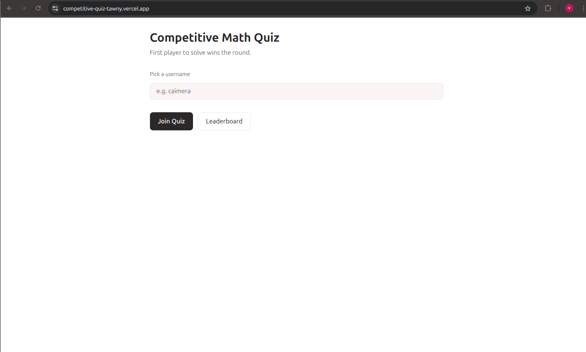
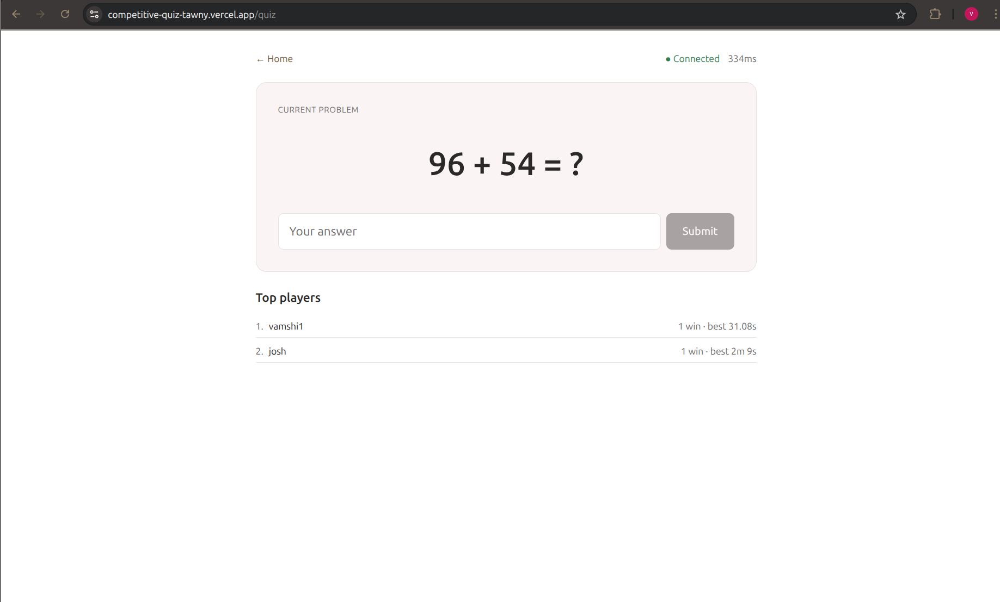
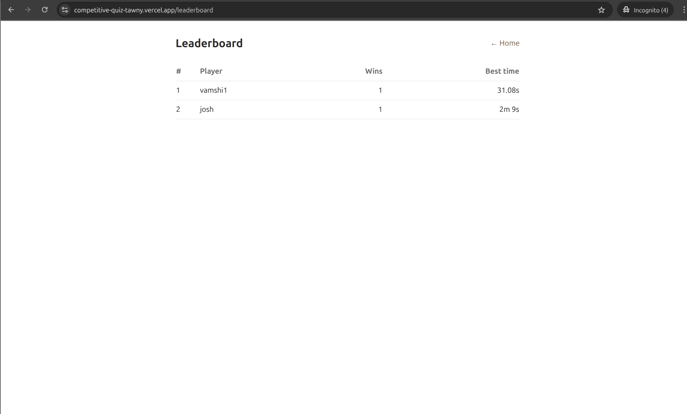
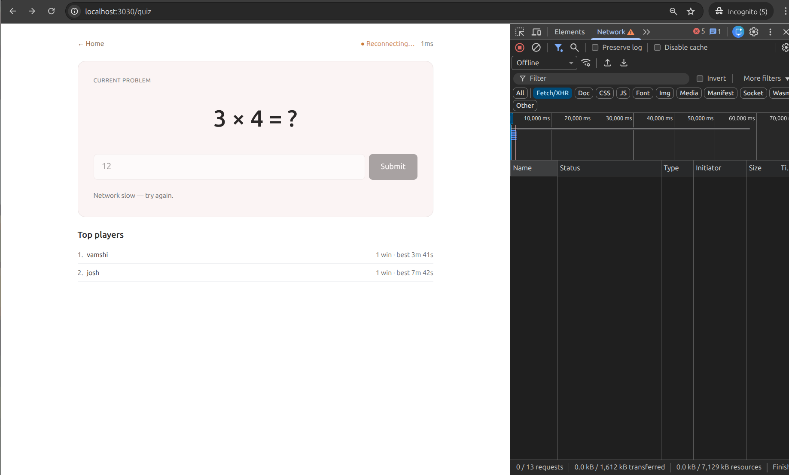

# Competitive Math Quiz

Real-time multiplayer math quiz. All connected users see the same problem — **first correct answer wins**, a new problem is generated, and the leaderboard updates live.

**Live demo:** https://competitive-quiz-tawny.vercel.app

Monorepo: Next.js frontend + Socket.IO WS server.

## Screenshots

### Landing page


### Live quiz


### Leaderboard


### Offline / reconnect handling


## Layout
- `web/` — Next.js 14 (App Router, TS, Tailwind)
- `server/` — Node + Express + Socket.IO

## Run locally

```bash
# terminal 1 — WS server
cd server
npm install
npm run dev          # :5030

# terminal 2 — Next.js
cd web
cp .env.local.example .env.local
npm install
npm run dev          # :3030
```

Open http://localhost:3030 in two browsers/tabs, enter different usernames, and race.

## Deploy
- `web/` → Vercel (set `NEXT_PUBLIC_WS_URL`)
- `server/` → Railway / Fly / Render (set `CORS_ORIGIN` to Vercel URL)

See `DEPLOYMENT.md` for the step-by-step checklist.
